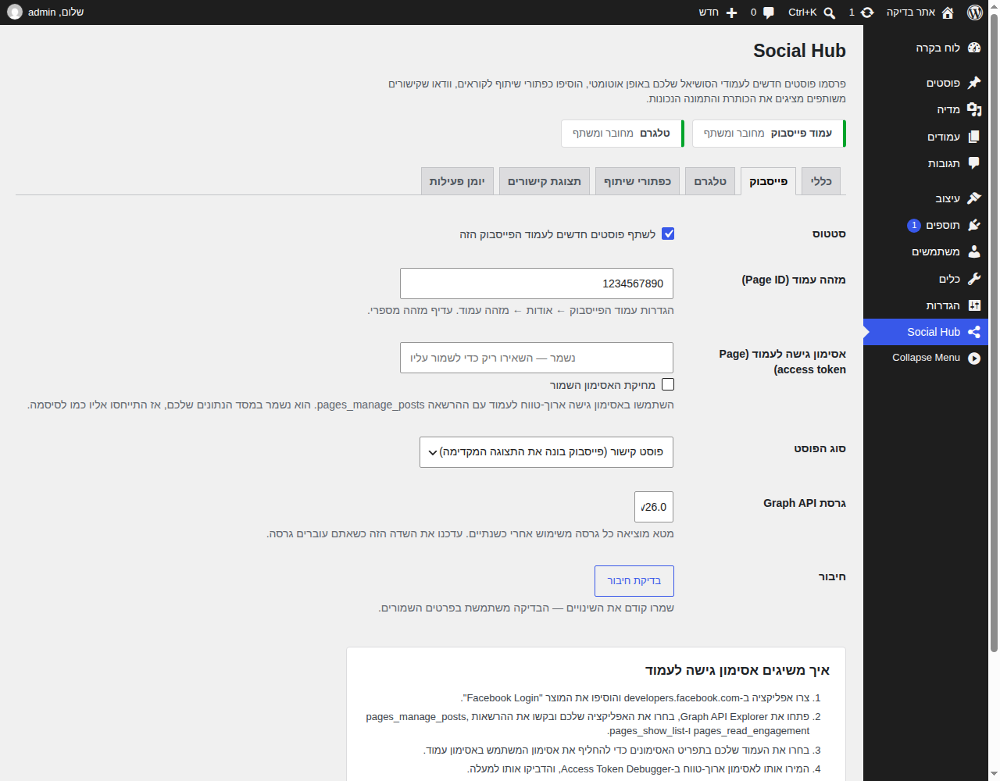
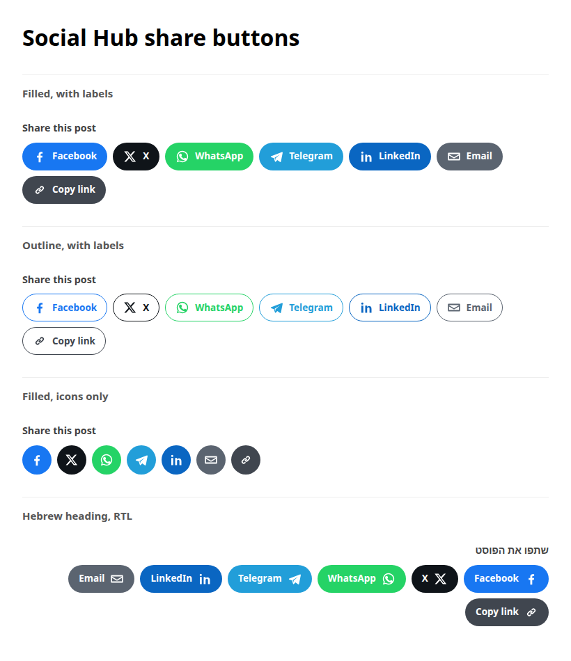
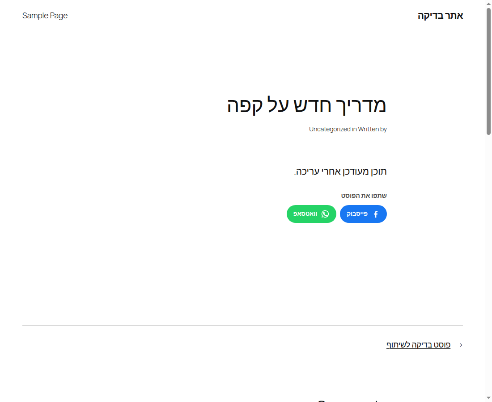
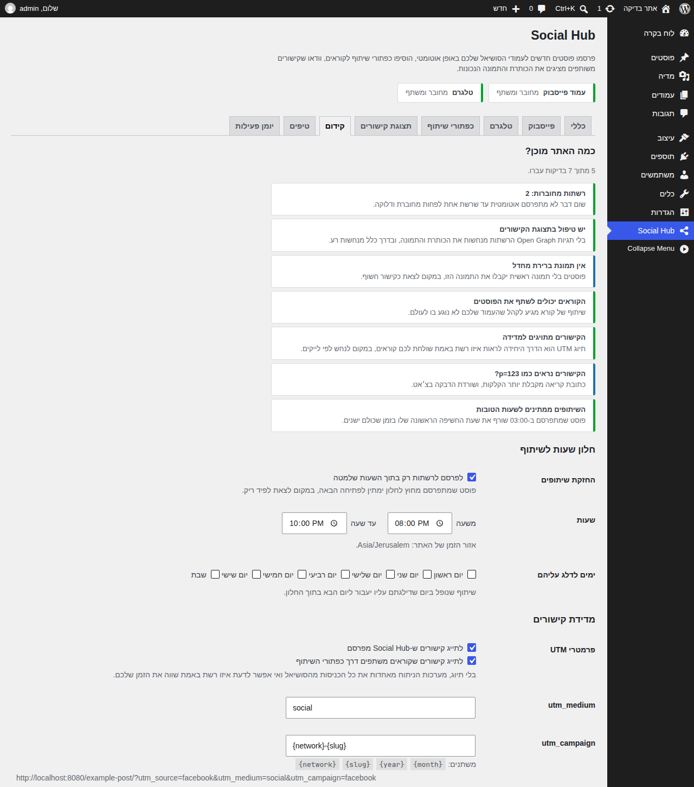
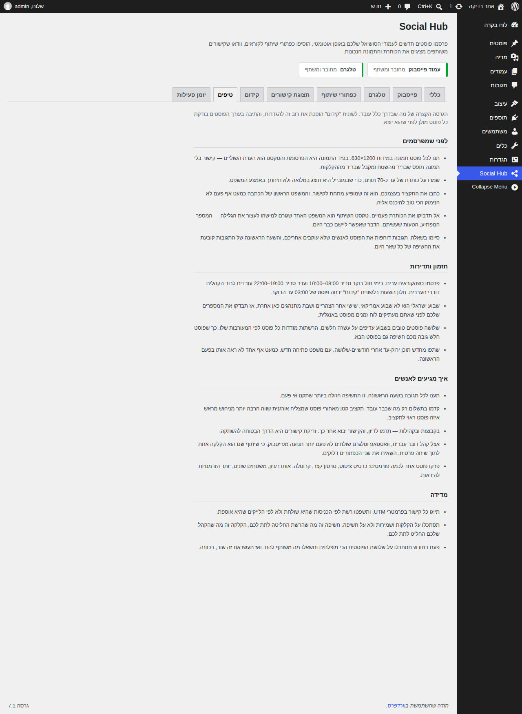

# Social Hub — תוסף סושיאל לוורדפרס

תוסף וורדפרס שמחבר את האתר שלכם לרשתות החברתיות: פרסום אוטומטי של פוסטים חדשים
לעמוד פייסבוק ולערוץ טלגרם, כפתורי שיתוף לקוראים, ותגיות Open Graph שדואגות שכל
קישור שמשתפים ייראה נכון (כותרת, תיאור ותמונה).

התוסף עצמו נמצא בתיקייה [`social-hub/`](social-hub) והוא עצמאי לגמרי — אין תלות
בספריות חיצוניות, ואין שירות מתווך באמצע. האתר שלכם מדבר ישירות מול ה-API של
פייסבוק ושל טלגרם.

הממשק מתורגם לעברית במלואו (נטען אוטומטית כשהאתר בעברית).

## מה יש בפנים

| יכולת | פירוט |
| --- | --- |
| פרסום אוטומטי | כשפוסט עובר לסטטוס "פורסם", התוסף שולח אותו לרשתות המחוברות דרך משימה מתוזמנת (לא מעכב את השמירה) |
| פייסבוק | פרסום לעמוד עסקי דרך Graph API v26.0 — כפוסט קישור או כפוסט תמונה עם התמונה הראשית |
| טלגרם | שליחה לערוץ או לקבוצה דרך בוט |
| תבנית הודעה | `{title}`, `{excerpt}`, `{url}`, `{site}`, `{author}`, `{tags}`, `{categories}`, `{date}` |
| שליטה לכל פוסט | תיבה בעורך: הודעה מותאמת, "לא לשתף את הפוסט הזה", וכפתור "שיתוף עכשיו" |
| כפתורי שיתוף | פייסבוק, X, וואטסאפ, טלגרם, לינקדאין, אימייל והעתקת קישור — מעל/מתחת לתוכן, בשורטקוד או בקוד התבנית |
| תצוגת קישורים | תגיות Open Graph ו-Twitter Card, עם זיהוי אוטומטי של תוספי SEO כדי לא לייצר כפילות |
| בדיקת מוכנות | לפני שפוסט יוצא, התוסף בודק אותו: תמונה 1200×630, אורך כותרת, תקציר ידני, אורך טקסט, תגיות, ושאלה שמזמינה תגובות |
| חלון שעות שיא | פוסט שמתפרסם ב-03:00 ממתין ל-09:00 במקום לשרוף את שעת החשיפה הראשונה על פיד ריק; אפשר גם לדלג על ימים |
| מדידה | פרמטרי UTM אוטומטיים על כל קישור יוצא, בנפרד לפרסום אוטומטי ולשיתופים של קוראים |
| טיפים בתוך הממשק | לשונית עם מה שבאמת מזיז את המספרים, ומדריך מלא ב-[`docs/social-playbook-he.md`](docs/social-playbook-he.md) |
| יומן פעילות | 100 הניסיונות האחרונים עם הודעת השגיאה המדויקת שחזרה מה-API |



## התקנה

1. העתיקו את התיקייה `social-hub/` אל `wp-content/plugins/` באתר שלכם
   (או ארזו אותה ל-ZIP והעלו דרך **תוספים ← הוספת תוסף ← העלאת תוסף**).
2. הפעילו את התוסף.
3. היכנסו לתפריט **Social Hub** בסרגל הצד של מערכת הניהול.

דרישות: וורדפרס 6.5 ומעלה, PHP 7.4 ומעלה.

## חיבור עמוד פייסבוק

פייסבוק לא מאפשרת פרסום אוטומטי לפרופיל אישי — רק לעמוד עסקי.

1. צרו אפליקציה ב-[developers.facebook.com](https://developers.facebook.com/apps/).
2. פתחו את **Graph API Explorer**, בחרו את האפליקציה, ובקשו את ההרשאות
   `pages_manage_posts`, `pages_read_engagement` ו-`pages_show_list`.
3. בתפריט האסימונים בחרו את העמוד שלכם — כך מקבלים *Page access token* במקום
   אסימון משתמש.
4. המירו אותו לאסימון ארוך-טווח ב-[Access Token Debugger](https://developers.facebook.com/tools/debug/accesstoken/)
   (כפתור *Extend Access Token*).
5. הדביקו את מזהה העמוד ואת האסימון בלשונית **Facebook** בהגדרות התוסף, שמרו,
   ולחצו **בדיקת חיבור** — אמור להופיע שם העמוד.

האסימון נשמר בטבלת ההגדרות של וורדפרס. הוא שקול לסיסמה, אז מי שיש לו גישה
למסד הנתונים יכול לפרסם בשמכם.

## חיבור טלגרם

1. פתחו צ׳אט עם [@BotFather](https://t.me/BotFather), שלחו `/newbot` וקבלו אסימון.
2. הוסיפו את הבוט כמנהל בערוץ או בקבוצה שלכם.
3. בלשונית **Telegram** הזינו את האסימון ואת `@שם_הערוץ` (או מזהה מספרי לערוץ פרטי).

## כפתורי שיתוף

ברירת המחדל מוסיפה את הכפתורים מתחת לתוכן הפוסט. אם בוחרים במיקום
"רק במקום שאבחר", אפשר למקם אותם ידנית:

```text
[social_hub_share]
[social_hub_share networks="facebook,whatsapp" labels="0" heading="שתפו"]
```

ובקובץ תבנית:

```php
<?php social_hub_share_buttons( array( 'style' => 'outline' ) ); ?>
```



כך זה נראה בפוסט אמיתי:



## קידום: מה התוסף עושה בשבילכם

לא מספיק לשלוח פוסט לרשת — צריך שהוא ייראה טוב, ייצא בזמן הנכון, ושתדעו מה עבד.
שלוש הלשוניות האלה עוסקות בדיוק בזה:

- **קידום** — רשימת מוכנות ברמת האתר (רשת מחוברת? תצוגת קישורים? תמונת ברירת מחדל?
  מדידה?), חלון השעות שבו מותר לשתף, ופרמטרי ה-UTM.
- **טיפים** — הגרסה הקצרה והמעשית: מה לעשות לפני הפרסום, מתי לפרסם, איך להפיץ,
  ומה למדוד. המדריך המלא נמצא ב-[`docs/social-playbook-he.md`](docs/social-playbook-he.md).
- **התיבה בעורך** — לפני שהפוסט יוצא היא מציגה "מוכנות לשיתוף: 4 מתוך 6" ומפרטת רק
  את מה שכדאי לתקן, עם הסבר קצר למה זה משנה.





מדידה בפועל: עם UTM דלוק, כל קישור יוצא מקבל `utm_source` לפי הרשת,
`utm_medium=social` לפרסום אוטומטי ו-`utm_medium=share_button` לשיתוף של קורא. כך
ב-Google Analytics אפשר להשוות ישירות בין פייסבוק, טלגרם והקוראים עצמם.

## הוקים למפתחים

```php
// לא לשתף פוסטים מקטגוריה מסוימת.
add_filter( 'social_hub_should_share', function ( $share, $post ) {
	return has_category( 'internal', $post ) ? false : $share;
}, 10, 2 );

// לשנות את ההודעה לפני השליחה.
add_filter( 'social_hub_message', function ( $message, $post ) {
	return $message . "\n\n#הבלוג_שלי";
}, 10, 2 );
```

פילטרים ופעולות נוספים: `social_hub_share_payload`, `social_hub_providers`,
`social_hub_open_graph_tags`, `social_hub_share_buttons_html`,
`social_hub_capability`, והפעולה `social_hub_shared`.

הוספת רשת חדשה נעשית דרך `social_hub_providers`: יורשים מ-`SocialHub\Providers\Provider`
ומממשים `id()`, `label()`, `is_configured()`, `publish()` ו-`test()`.

## בדיקות

הבדיקות רצות ללא התקנת וורדפרס — `tests/bootstrap.php` מכיל תחליפים לפונקציות
שהתוסף משתמש בהן, וה-HTTP ממוקק, כך שאף בקשה אמיתית לא יוצאת החוצה:

```bash
php tests/run.php          # 49 בדיקות: הגדרות, פרסום, ספקים, כפתורים, תזמון, UTM, בדיקות מוכנות
php tests/preview.php > preview.html   # עמוד תצוגה של כפתורי השיתוף
```

מעבר לכך, התוסף הורץ בהתקנת וורדפרס אמיתית (7.1, PHP 8.3) עם ממשק בעברית:
שמירת הגדרות, פרסום פוסט שהפעיל את משימת השיתוף, כפתורי "בדיקת חיבור" ו"שיתוף
עכשיו", והתגיות בקוד המקור של העמוד — הכול בלי אזהרה אחת ביומן השגיאות.

## מבנה הקוד

```text
social-hub/
├── social-hub.php              קובץ התוסף הראשי
├── includes/
│   ├── class-settings.php      קריאה, כתיבה וסניטציה של ההגדרות
│   ├── class-publisher.php     מה משותף, מתי, ועם איזה טקסט
│   ├── class-advisor.php       בדיקות המוכנות לפוסט ולאתר
│   ├── class-timing.php        חלון שעות השיא
│   ├── class-tracking.php      פרמטרי UTM
│   ├── class-providers.php     רישום הרשתות
│   ├── class-open-graph.php    תגיות התצוגה המקדימה
│   ├── class-share-buttons.php הכפתורים בצד הקוראים
│   ├── class-log.php           יומן הפעילות
│   ├── providers/              Facebook, Telegram, ומחלקת הבסיס
│   └── admin/                  תפריט, עמוד הגדרות ותיבת העורך
├── assets/                     CSS ו-JS
└── languages/                  עברית + קובץ POT
```

---

## English summary

**Social Hub** is a self-contained WordPress plugin for social media:

- Auto-publishes new posts to a **Facebook Page** (Graph API v26.0) and a
  **Telegram** channel, on a delayed cron event so publishing stays fast.
- Configurable message template with post placeholders, plus per-post overrides
  and a **Share now** button in the editor.
- Front-end **share buttons** (Facebook, X, WhatsApp, Telegram, LinkedIn, email,
  copy link) via auto-append, shortcode or template tag.
- **Open Graph / Twitter Card** tags, skipped automatically when an SEO plugin
  already outputs them.
- A **promotion advisor**: per-post readiness checks (image size, headline length,
  hand-written excerpt, share text length, tags, a question that invites replies)
  and a site-wide checklist.
- A **sharing window** so a post written at 03:00 goes out at 09:00, and **UTM
  tagging** so analytics can tell the networks apart.
- A **Tips** tab in the admin, plus a full Hebrew playbook in
  [`docs/social-playbook-he.md`](docs/social-playbook-he.md).
- Activity log with the exact API error for every failed attempt.

Install by copying `social-hub/` into `wp-content/plugins/`, activate, and open
the **Social Hub** menu. Run `php tests/run.php` for the test suite.
